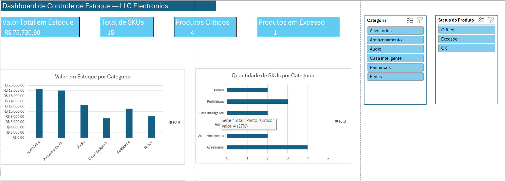
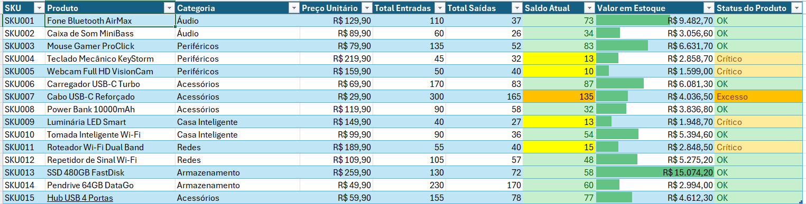
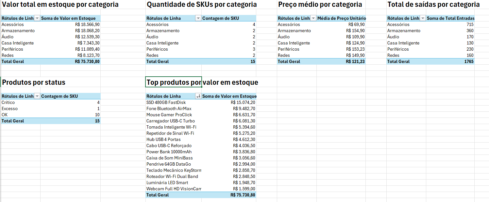

# Projeto 01 — Dashboard de Controle de Estoque com Excel

## Visão geral

Este projeto simula um cenário empresarial de controle de estoque para uma empresa fictícia chamada **LLC Electronics**.

O objetivo foi construir uma solução em **Microsoft Excel** capaz de organizar produtos cadastrados, registrar entradas e saídas de estoque, calcular indicadores operacionais e apresentar um dashboard visual para apoiar a tomada de decisão.

O projeto foi desenvolvido como parte da construção do meu portfólio em **Análise de Dados e Ciência de Dados**, com foco em Excel intermediário, organização de dados, fórmulas, tabelas estruturadas, tabelas dinâmicas, gráficos dinâmicos e dashboard.

---

## Problema de negócio

A empresa precisava acompanhar melhor seu estoque, pois os dados estavam espalhados entre cadastro de produtos, entradas e saídas. Sem uma visão consolidada, era difícil responder perguntas como:

- Quais produtos têm maior valor financeiro em estoque?
- Quais produtos estão em situação crítica?
- Quais produtos estão com excesso de estoque?
- Qual categoria concentra mais dinheiro parado?
- Quais categorias possuem mais saídas?
- Quantos produtos existem por status de estoque?

A solução proposta foi criar uma planilha estruturada com cálculos automáticos e um painel visual interativo.

---

## Objetivos do projeto

- Criar uma base de cadastro de produtos.
- Registrar movimentações de entrada e saída de estoque.
- Calcular saldo atual por SKU.
- Calcular valor financeiro em estoque.
- Classificar produtos automaticamente por status.
- Criar tabelas dinâmicas para análise.
- Criar gráficos dinâmicos para visualização.
- Montar um dashboard interativo com segmentações de dados.
- Versionar o projeto no GitHub.

---

## Ferramentas utilizadas

- Microsoft Excel
- Tabelas estruturadas
- Fórmulas Excel
- Tabelas dinâmicas
- Gráficos dinâmicos
- Segmentações de dados
- Git
- GitHub

---

## Estrutura do projeto

```text
excel-controle-estoque/
│
├── README.md
├── dashboard-estoque.xlsx
├── .gitignore
│
├── imagens/
│   ├── painel-final.png
│   ├── resumo-estoque.png
│   ├── tabelas-dinamicas.png
│   └── segmentacoes.png
│
└── dados/
```

---

## Bases criadas no Excel

O arquivo principal do projeto é:

```text
dashboard-estoque.xlsx
```

Ele contém as seguintes abas:

| Aba | Descrição |
|---|---|
| Cadastro | Base mestre com os produtos cadastrados |
| Entrada | Registro das movimentações de entrada de estoque |
| Saída | Registro das movimentações de saída de estoque |
| Resumo Estoque | Consolidação analítica com fórmulas |
| Tabelas Dinâmicas | Base resumida para análises e gráficos |
| Painel | Dashboard final com indicadores, gráficos e filtros |

---

## Modelo de dados

O projeto foi organizado com base em três tabelas principais:

### 1. Cadastro de produtos

Tabela estruturada: `tbCadastro`

Contém informações como:

- SKU
- Produto
- Descrição
- Categoria
- Preço unitário
- Fornecedor
- Data de cadastro

### 2. Entradas de estoque

Tabela estruturada: `tbEntrada`

Contém informações como:

- Data
- SKU
- Produto
- Quantidade entrada
- Responsável
- Observação

### 3. Saídas de estoque

Tabela estruturada: `tbSaida`

Contém informações como:

- Data
- SKU
- Produto
- Quantidade saída
- Canal de venda
- Observação

---

## Fórmulas utilizadas

Na aba **Resumo Estoque**, foram criadas fórmulas para consolidar os dados automaticamente.

### Busca do produto pelo SKU

```excel
=PROCX([@SKU];tbCadastro[SKU];tbCadastro[Produto];"Não encontrado")
```

### Busca da categoria

```excel
=PROCX([@SKU];tbCadastro[SKU];tbCadastro[Categoria];"Não encontrado")
```

### Busca do preço unitário

```excel
=PROCX([@SKU];tbCadastro[SKU];tbCadastro[Preço Unitário];0)
```

### Total de entradas por SKU

```excel
=SOMASES(tbEntrada[Quantidade Entrada];tbEntrada[SKU];[@SKU])
```

### Total de saídas por SKU

```excel
=SOMASES(tbSaida[Quantidade Saída];tbSaida[SKU];[@SKU])
```

### Saldo atual

```excel
=[@[Total Entradas]]-[@[Total Saídas]]
```

### Valor em estoque

```excel
=[@[Saldo Atual]]*[@[Preço Unitário]]
```

### Status do produto

```excel
=SES([@[Saldo Atual]]<0;"Estoque Negativo";[@[Saldo Atual]]=0;"Obsoleto";[@[Saldo Atual]]<=20;"Crítico";[@[Saldo Atual]]<=100;"OK";[@[Saldo Atual]]>100;"Excesso")
```

---

## Regras de classificação do estoque

| Condição | Status |
|---|---|
| Saldo menor que 0 | Estoque Negativo |
| Saldo igual a 0 | Obsoleto |
| Saldo entre 1 e 20 | Crítico |
| Saldo entre 21 e 100 | OK |
| Saldo acima de 100 | Excesso |

Essa classificação permite identificar rapidamente produtos que exigem atenção operacional.

---

## Indicadores do dashboard

O dashboard apresenta os seguintes indicadores principais:

| Indicador | Descrição |
|---|---|
| Valor Total em Estoque | Soma do valor financeiro parado em estoque |
| Total de SKUs | Quantidade de produtos cadastrados |
| Produtos Críticos | Quantidade de produtos com baixo saldo |
| Produtos em Excesso | Quantidade de produtos acima do nível ideal |

---

## Análises criadas

Foram criadas tabelas dinâmicas e gráficos para responder às principais perguntas do negócio:

- Valor total em estoque por categoria.
- Quantidade de SKUs por categoria.
- Preço médio por categoria.
- Total de saídas por categoria.
- Quantidade de produtos por status.
- Top produtos por valor em estoque.

---

## Dashboard final

O painel final foi construído com gráficos dinâmicos, indicadores e segmentações de dados.

((imagens/painel-final2.png))

---

## Resumo analítico de estoque

A aba **Resumo Estoque** consolida as informações de cadastro, entrada e saída, permitindo acompanhar saldo atual, valor financeiro e status de cada produto.



---

## Tabelas dinâmicas

As tabelas dinâmicas foram utilizadas como base para resumir os dados e alimentar os gráficos do dashboard.



---

## Segmentações de dados

O painel possui segmentações para facilitar a análise por categoria e status do produto.


---

## Principais aprendizados

Durante o desenvolvimento deste projeto, foram praticados conceitos importantes de Excel aplicado à análise de dados:

- Organização de bases em tabelas estruturadas.
- Uso de SKU como chave de relacionamento entre tabelas.
- Aplicação de fórmulas para busca e consolidação de dados.
- Uso de `SOMASES` para agregações condicionais.
- Criação de regras automáticas de status.
- Aplicação de formatação condicional.
- Criação de tabelas dinâmicas.
- Criação de gráficos dinâmicos.
- Construção de dashboard visual.
- Versionamento de projeto com Git e GitHub.

---

## Competências demonstradas

Este projeto demonstra habilidades em:

- Excel intermediário
- Análise de dados
- Organização de bases
- Indicadores de negócio
- Visualização de dados
- Dashboard operacional
- Documentação de projeto
- Git e GitHub

---

## Possíveis melhorias futuras

Algumas melhorias que podem ser adicionadas em versões futuras:

- Criar uma aba de cadastro de fornecedores.
- Adicionar controle de estoque mínimo por produto.
- Criar alertas automáticos para reposição.
- Adicionar margem de lucro e preço de venda.
- Criar análise de giro de estoque.
- Adicionar análise temporal por mês.
- Conectar a base a um dashboard em Power BI.
- Recriar o projeto usando SQL e Python.

---

## Conclusão

Este projeto mostra como o Excel pode ser usado para transformar dados operacionais simples em uma ferramenta de análise e tomada de decisão.

A solução permite acompanhar entradas, saídas, saldo atual, valor financeiro em estoque e status dos produtos, oferecendo uma visão clara para gestão de estoque.

Mais do que criar uma planilha, o foco foi construir uma solução organizada, documentada e apresentável como projeto de portfólio.

---

## Autor

**Jarleson Oliveira**

Projeto desenvolvido como parte do meu portfólio de estudos em Análise de Dados, Ciência de Dados e Engenharia de Dados.
